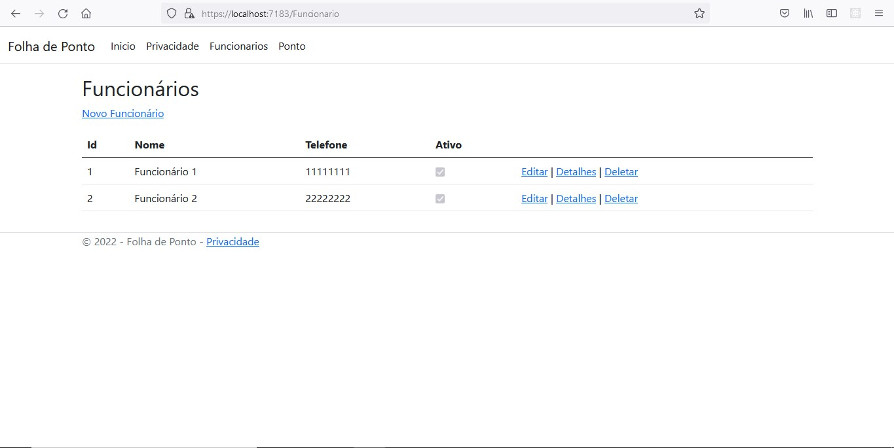
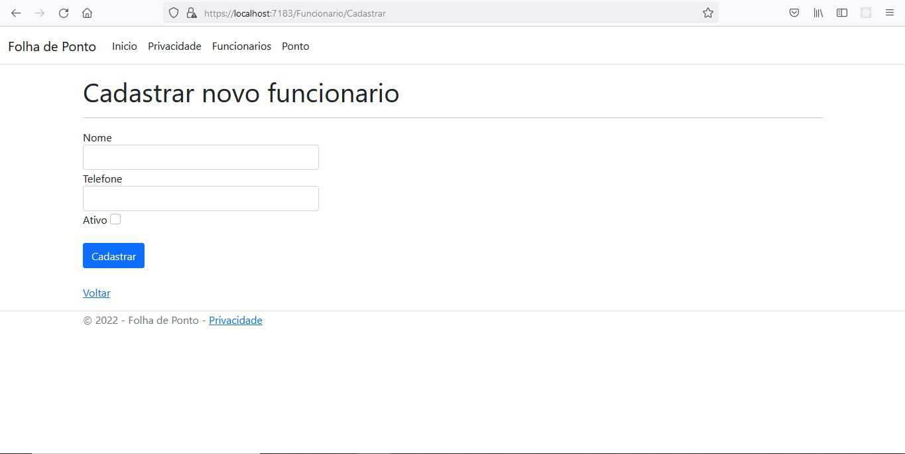
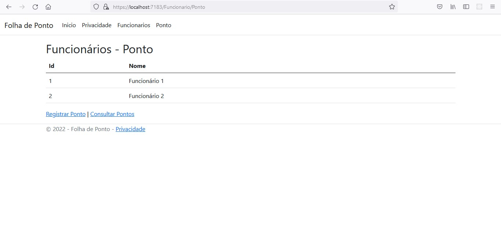
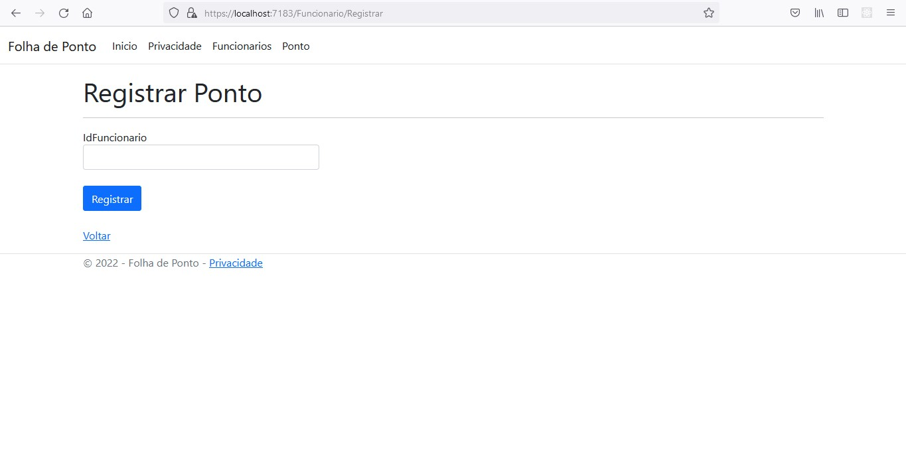
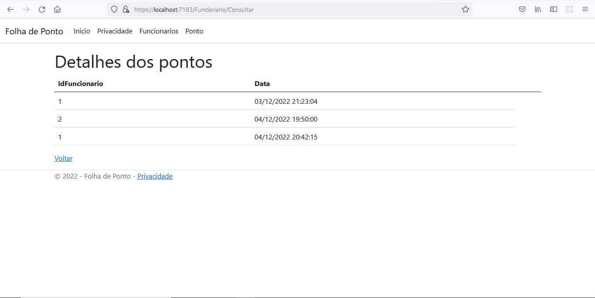
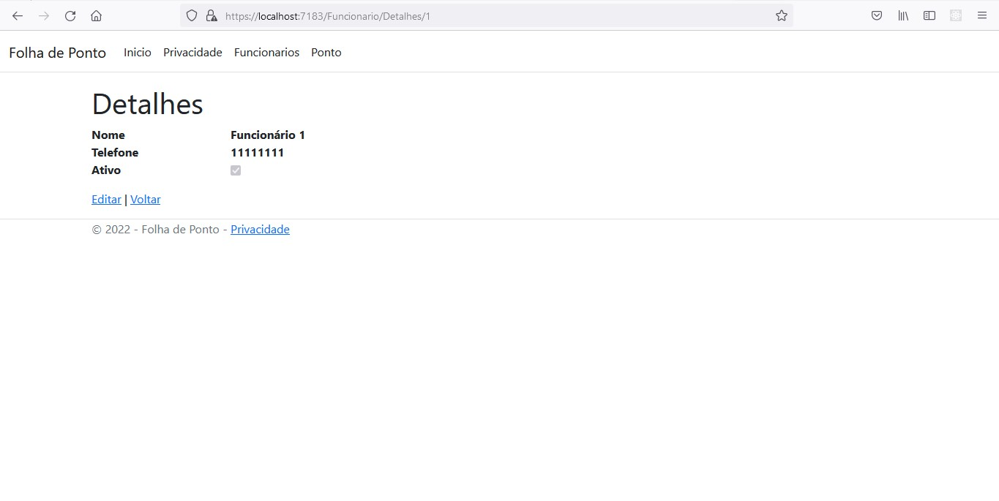
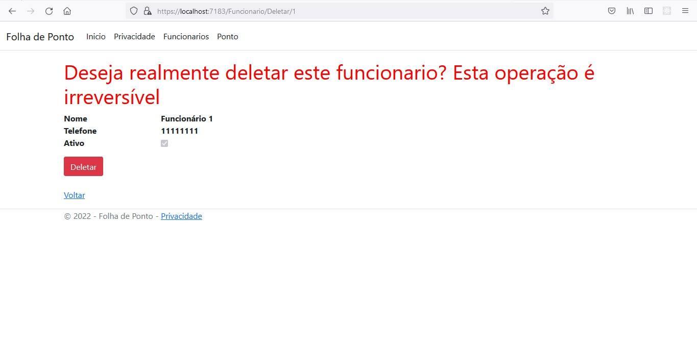

# Controle de Folha de Ponto

Sistema de registro da folha de ponto, onde possuem as seguintes funcionalidades:

* Listagem de todos os funcionários cadastrados
* Cadastro do funcionário
* Consulta do cadastro do funcionário
* Edição do cadastro do funcionário
* Exclusão do cadastro do funcionário
* Registro do ponto do funcionário
* Listagem de todos os pontos registrados

## Imagens do sistema

